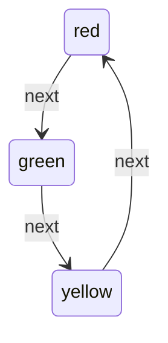

# Automaton

Lightweight and easy to use state machine. I have plans to update it as I test it out on my personal projects. Core is simple and extensible by wrapping it to create additional functionalities like logging, undo/redo, hierarchical state machines, visualizer by returning Mermaid js formatted string etc etc. 

It might turn out to be opiniated form of state machine as well. The primary function in mind is to use it for application development state management mainly for use in/with view model and for managing navigation states.

Initialize state machine using atomic transitions

```swift
StateMachine<TrafficLight, TrafficLight.Transition>(
    transitions: [
        (.red, .next, .green),
        (.green, .next, .yellow),
        (.yellow, .next, .red)
    ]
)
```

Init can fail when same initial state uses same event for different destinations.

Above initialization creates an state machine like



Now the idea is to validate the possible next states based on created state machine and throw error when passed next state can be invalid

```swift
switch stateMachine.changeState(for: .next) {
case .success(let state):
    XCTAssertEqual(state, .green)
case .failure(_):
    XCTFail("This is an impossible state")
}
``` 
